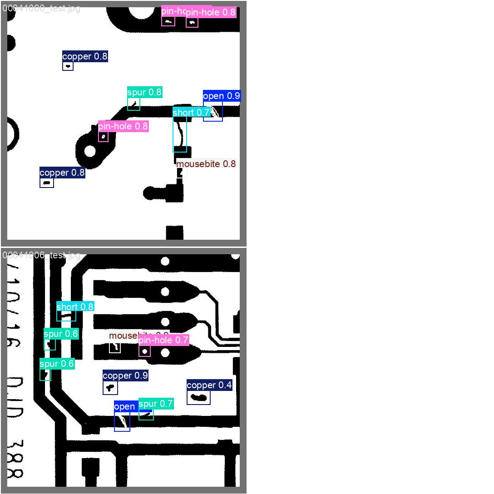
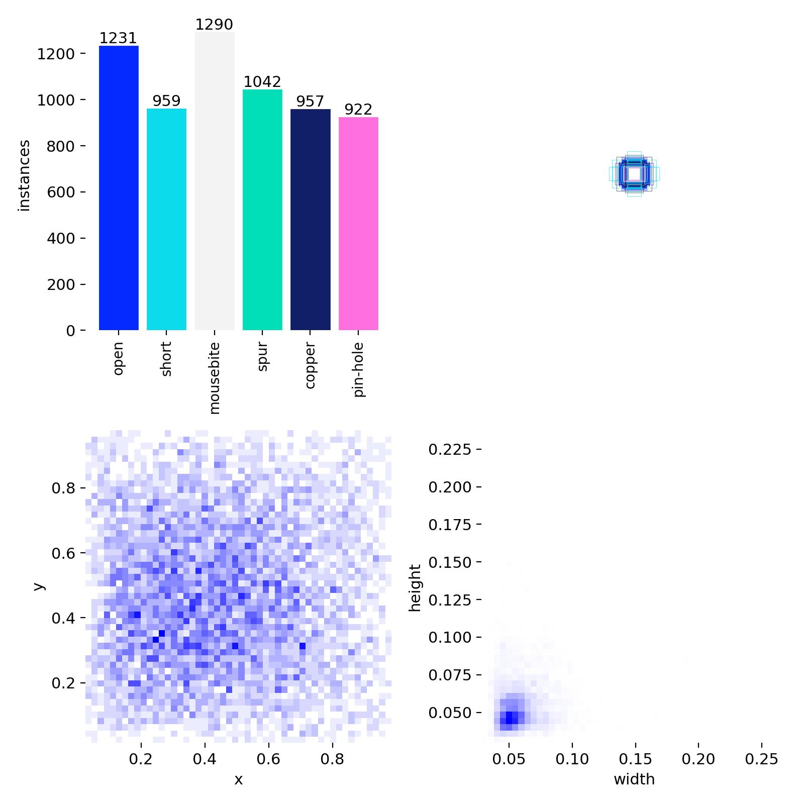
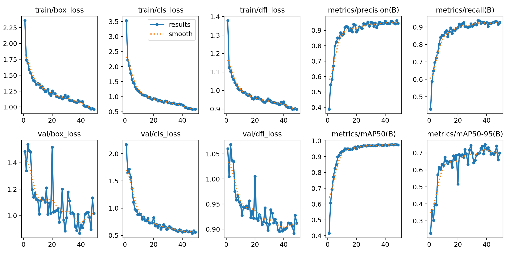
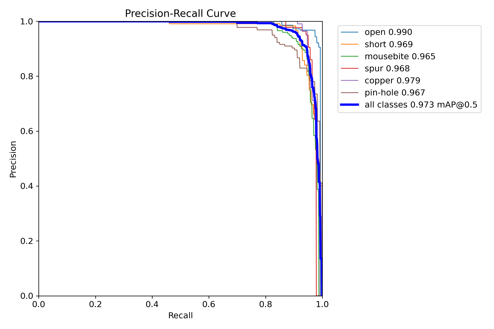
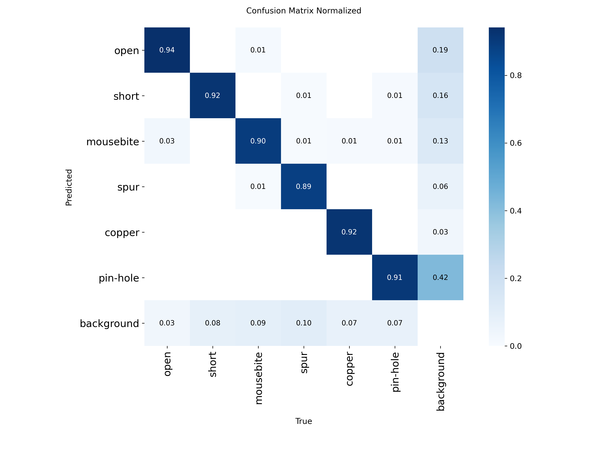

# PCB Fault Detection Dashboard

Computer vision system for detecting manufacturing defects on printed circuit boards using YOLO object detection and a Streamlit inspection dashboard.

The model detects six PCB defect classes:

| ID | Defect |
|---:|---|
| 0 | open |
| 1 | short |
| 2 | mousebite |
| 3 | spur |
| 4 | copper |
| 5 | pin-hole |



## Project Goal

The goal of this project is to support automated PCB visual inspection. Instead of only classifying an image as normal or defective, the system localizes each defect with a bounding box and identifies its defect type.

The final application includes:

- YOLO-based PCB defect detection
- GPU training through WSL2
- Dataset conversion from DeepPCB annotations to YOLO format
- Streamlit dashboard with login
- PCB image scanner
- Dataset gallery browser
- Evaluation and training-graph documentation page

## Dataset Source

This project uses the public **DeepPCB** dataset:

[https://github.com/tangsanli5201/DeepPCB](https://github.com/tangsanli5201/DeepPCB)

According to the DeepPCB repository, the dataset contains 1,500 PCB image pairs. Each pair includes a defect-free template image and an aligned tested image with annotations for six common PCB defects: open, short, mousebite, spur, pin hole, and spurious copper.

The original annotation format is:

```text
x1 y1 x2 y2 class_id
```

where `(x1, y1)` is the top-left bounding-box corner and `(x2, y2)` is the bottom-right corner.

This project converts those labels into YOLO format:

```text
class_id x_center y_center width height
```

where all coordinates are normalized between 0 and 1.

## Dataset Preparation

The raw dataset was scanned and cleaned before training.

Local cleaned dataset summary:

| Split | Images | Label Files | Defect Boxes |
|---|---:|---:|---:|
| train | 918 | 918 | 6401 |
| val | 114 | 114 | 813 |
| test | 116 | 116 | 820 |

The original dataset included unlabeled images in one group. Those samples were moved into:

```text
data/excluded_missing_labels/
```

The active YOLO dataset is stored in:

```text
data/processed/yolo/
  images/
    train/
    val/
    test/
  labels/
    train/
    val/
    test/
  deeppcb.yaml
```



## Model

The final training path uses **Ultralytics YOLOv8**.

TensorFlow/KerasCV was tested first, but the GTX 1060 Max-Q and TensorFlow/cuDNN stack produced GPU convolution compatibility errors. YOLOv8 with PyTorch CUDA 12.4 was selected because it trained reliably on the same GPU.

Training environment:

| Component | Value |
|---|---|
| OS | Windows 11 + WSL2 Ubuntu |
| GPU | NVIDIA GeForce GTX 1060 Max-Q, 6 GB VRAM |
| Framework | Ultralytics YOLOv8 |
| PyTorch | CUDA 12.4 build |
| Model | YOLOv8n |
| Image size | 640 |

## Training Results

Best completed run:

```text
models/yolo_runs/deeppcb_yolov8n_640-3/
```

Final validation metrics:

| Metric | Value |
|---|---:|
| Precision | 0.946 |
| Recall | 0.927 |
| mAP50 | 0.975 |
| mAP50-95 | 0.699 |

These results indicate strong detection performance. The model detects most PCB defects and places bounding boxes accurately enough for visual inspection and demonstration use.



## Evaluation Graphs

### Precision-Recall Curve

The PR curve shows how precision changes as recall increases. A curve close to the top-right area indicates strong detection quality.



### Confusion Matrix

The normalized confusion matrix shows how often each defect type is predicted correctly and where class confusion occurs.



## Project Structure

```text
pcb_fault_detection/
  app/
    streamlit_app.py
  data/
    processed/
      yolo/
        images/
        labels/
        deeppcb.yaml
  docs/
    images/
  models/
    yolo_runs/
  scripts/
    convert_deeppcb_to_yolo.py
    scan_dataset.py
    split_dataset.py
    train_yolo.py
  requirements.txt
  README.md
```

## Installation

### 1. Create And Activate WSL Environment

Inside Ubuntu/WSL:

```bash
mkdir -p ~/venvs
python3 -m venv ~/venvs/pcb-fault-gpu
source ~/venvs/pcb-fault-gpu/bin/activate
python -m pip install --upgrade pip setuptools wheel
```

### 2. Install Dependencies

For the GPU YOLO path:

```bash
pip install torch==2.5.1 torchvision==0.20.1 --index-url https://download.pytorch.org/whl/cu124
pip install ultralytics streamlit pandas pillow opencv-python matplotlib
```

### 3. Verify GPU

```bash
python -c "import torch; print(torch.__version__); print(torch.cuda.is_available())"
```

Expected:

```text
True
```

## Dataset Conversion

Run this after splitting the DeepPCB dataset:

```bash
cd /mnt/d/CV-PRO/pcb_fault_detection
source ~/venvs/pcb-fault-gpu/bin/activate
python scripts/convert_deeppcb_to_yolo.py
```

This creates:

```text
data/processed/yolo/deeppcb.yaml
```

## Training

Recommended command for a 6 GB GTX 1060 Max-Q:

```bash
python scripts/train_yolo.py \
  --model yolov8n.pt \
  --epochs 50 \
  --imgsz 640 \
  --batch 4 \
  --device 0 \
  --workers 2 \
  --name deeppcb_yolov8n_640
```

If VRAM is limited, reduce batch size:

```bash
python scripts/train_yolo.py \
  --model yolov8n.pt \
  --epochs 50 \
  --imgsz 640 \
  --batch 2 \
  --device 0 \
  --workers 2 \
  --name deeppcb_yolov8n_640_b2
```

Best weights are saved as:

```text
models/yolo_runs/<run_name>/weights/best.pt
```

## Inference

Run prediction on test images:

```bash
yolo detect predict \
  model=/mnt/d/CV-PRO/pcb_fault_detection/models/yolo_runs/deeppcb_yolov8n_640-3/weights/best.pt \
  source=/mnt/d/CV-PRO/pcb_fault_detection/data/processed/yolo/images/test \
  imgsz=640 \
  conf=0.25 \
  save=True
```

## Streamlit Dashboard

Run the dashboard:

```bash
cd /mnt/d/CV-PRO/pcb_fault_detection
source ~/venvs/pcb-fault-gpu/bin/activate
streamlit run app/streamlit_app.py --server.address 0.0.0.0 --server.port 8501 --server.headless true
```

Open:

```text
http://localhost:8501
```

Demo login:

```text
username: admin
password: pcb123
```

Dashboard pages:

- **Scanner**: upload a PCB image and detect defects
- **Dataset**: browse training, validation, and test images as a gallery
- **Model Explanation**: understand the model goal, metrics, and evaluation graphs

## Scripts

| Script | Purpose |
|---|---|
| `scan_dataset.py` | Audits the DeepPCB dataset and counts classes |
| `split_dataset.py` | Creates train/val/test splits |
| `convert_deeppcb_to_yolo.py` | Converts DeepPCB labels to YOLO format |
| `train_yolo.py` | Trains YOLOv8 on the PCB dataset |
| `streamlit_app.py` | Runs the dashboard |

## Notes

- The DeepPCB dataset is intended for research use.
- The trained model should be validated on unseen PCB images before industrial use.
- `best.pt` should be used for inference, not `last.pt`.
- Confidence threshold can be tuned in the dashboard to balance false alarms and missed defects.

## Citation / Acknowledgement

Dataset source:

```text
DeepPCB: https://github.com/tangsanli5201/DeepPCB
```

DeepPCB is described by its authors as a PCB defect dataset containing aligned template/test image pairs and bounding-box annotations for common PCB defect types.

